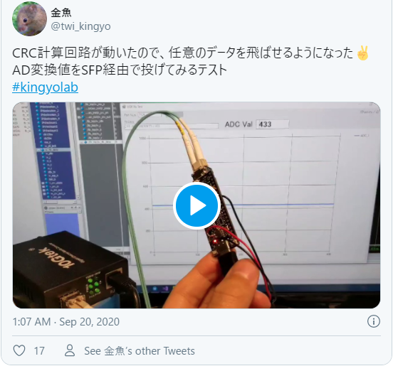
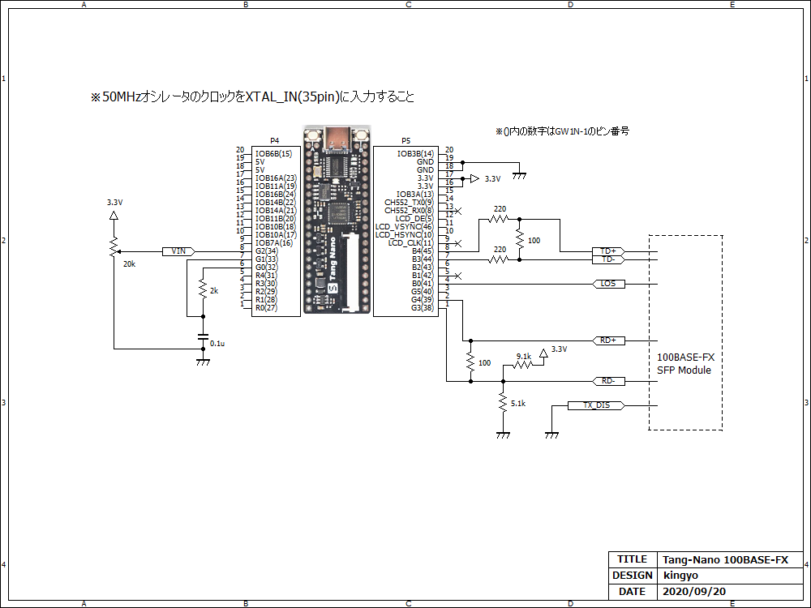
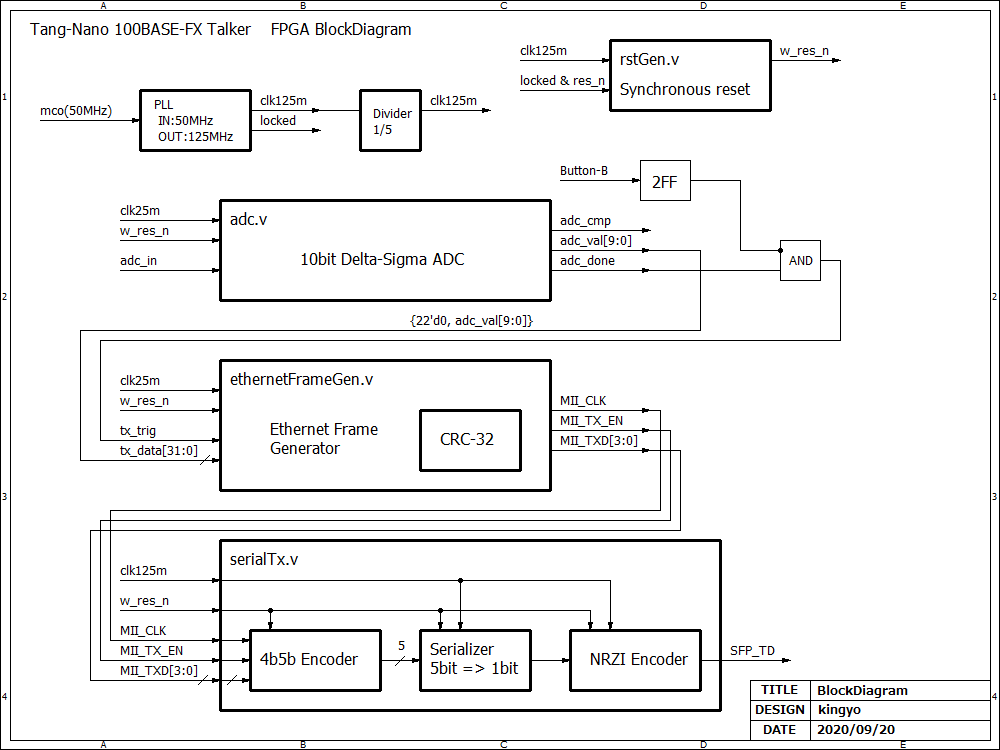

# Tang-Nano_100BASE-FX_Talker
Tang-Nano FPGAボードにSFPモジュール（光ファイバ）を接続して、100BASE-FXでUDPパケットを飛ばす実験サンプルです。

動作の様子 
[View tweet 

](https://twitter.com/twi_kingyo/status/1307350593678331904)

以下の環境で動作を確認しています。
100BASE-FXを受けられるL2SWなどであれば多分動くと思います。SFP+対応機器ではサポートされていない場合があるので仕様をご確認ください。  
- SFP Module: SFP-100FX-32 100BASE SFP 1310nm 2km (Fiberstore)
- Ethernet Media Converter: WG-33-1GX1GT-SFP (10Gtek)

# ハードウェア
至ってシンプルです。Tang-Nanoから差動3.3V信号を出力し、簡易的な抵抗ネットワークを通してSFPの差動入力端子に接続しています。  
送信データを生成するために、外部にDelta-Sigma ADCの回路を構成し、10bitでAD変換した結果を取得してUDP送信します。  
なお、Tang-Nanoには24MHzの水晶オシレータが搭載されていますが、PLLにより100BASE-FXで必要な125MHzを生成することができないため50MHzのオシレータの信号を別途入力しています。  
  
余談ですが、Tang-Nanoは基板配線の都合上、GNDにノイズが乗りやすいです。普通に使う分には問題になりませんが、LCDを動作させる場合や高速なクロックを使用する場合は、GNDを強化する改造を行ったほうが無難です。  
以下にGND強化の改造を行った際のPLL出力ジッタを調査した資料があるので参考ください。  
https://photos.app.goo.gl/G1rWaLsfJERK9acAA

# FPGA内部ブロック図
AD変換→変換完了トリガとボタンB入力をANDして、Ethernetフレーム送信トリガを生成→Ethernetフレーム生成→4b5b、シリアライズ、NRZIエンコードを掛けて出力しています。  
（図が適当で申し訳ありません・・・）  
  

# 実験方法
src/rtl/ethernetFrameGen.v に各種パラメタをparameter定義していますので、各自の環境に合わせて変更ください。  
特に"EtherDestinationMAC"は宛先ホストのMACアドレスを指定しないとブロードキャストされて大変なことになります・・・。  
Tang-Nanoに書き込んだ後、基板上のButton-Bを押すとAD変換結果がUDP送信されます。Wiresharkなどでキャプチャして動作を確認することができます。  

# 開発環境
- IDE : GOWIN FPGA Designer Version1.9.2.02 Beta build(35976)

# Resource Usage Summary:
|  Resource  |  Usage |  Utilization  |
| ---------- | ------ | ------------- |
|  Logics  |  300/1152  | 26% |
|  --LUTs,ALUs,ROM16s  |  300(272 LUTs, 28 ALUs, 0 ROM16s)  | - |
|  --SSRAMs(RAM16s)  |  0  | - |
|  Registers  |  116/945  | 12% |
|  --logic Registers  |  115/864  | 13% |
|  --I/O Registers  |  1/81  | 1% |
|  BSRAMs  |  0/4  | 0% |

# 参考
- 10BASE-T FPGA interface https://www.fpga4fun.com/10BASE-T.html
- CRCモジュール(Verilog-HDL) https://www.rightxlight.co.jp/technical/crc-verilog-hdl
- Ethernetのしくみとハードウェア設計技法 https://www.cqpub.co.jp/hanbai/books/33/33431.htm
- 高速Ethernet × FPGA (FPGAマガジン No.3) https://shop.cqpub.co.jp/detail/1508/
- マスタリングTCP/IP　入門編（第5版）https://www.ohmsha.co.jp/book/9784274224478/
